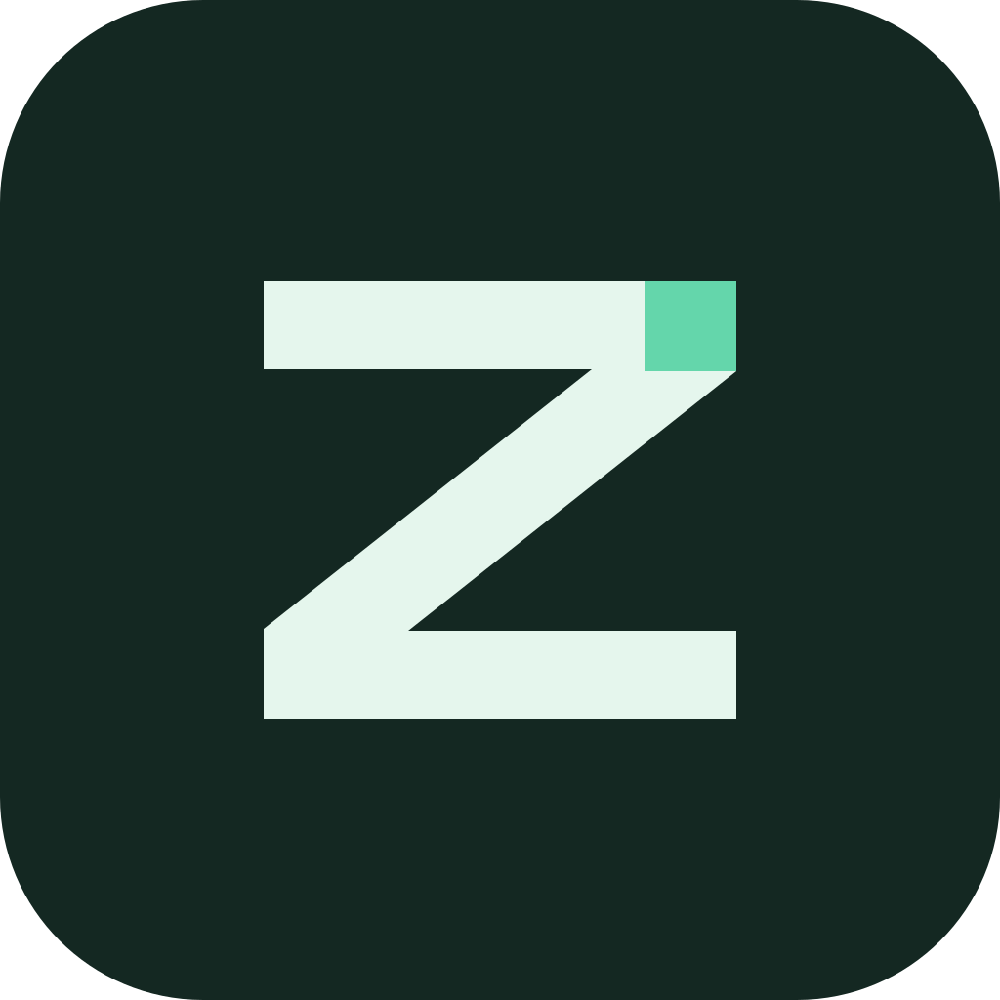

# zenwit

zenwit is a desktop agent application built on the DeepSeek Harness kernel. This project directly maintains Desktop and kernel source while preserving upstream licenses and attribution.



## Development

Use Node.js `^22.19.0` or `>=24.0.0` and the project's Yarn 4.18.0 through Corepack.

```sh
corepack yarn install --immutable
corepack yarn dev
```

Use `corepack yarn dev:beta` for Beta. Build with `corepack yarn build`, test with `corepack yarn test`, and typecheck with `corepack yarn typecheck`.

## Product Boundaries

- Stable is named `zenwit`; preview is `zenwit Beta`. Each uses separate application identity and data directories.
- Kernel source in `deepseek-harness/` is editable; rebuild and synchronize the Desktop runtime after changing it.
- Original automatic update and installer download services are disconnected. This version uses local builds and manual installation.
- Desktop startup disables built-in session telemetry. Model providers, remote access and third-party plugins may still use the network.
- No official zenwit download site, feedback service or signed release channel is claimed yet.

See [product identity and services](docs/zenwit-product.md), [local kernel development](docs/local-kernel.md) and [architecture](docs/architecture.en.md). Some historical documents still use the original product name.

## Origin And License

Based on [DeepSeek Harness](https://github.com/deepseek-ai/deepseek-harness) and [DSH Desktop](https://github.com/anywhere-labs/dsh-desktop). See [LICENSE](LICENSE) and the third-party notices in each package.
